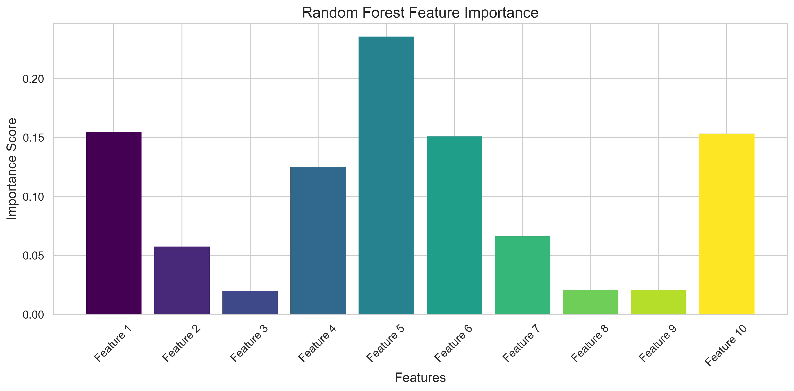
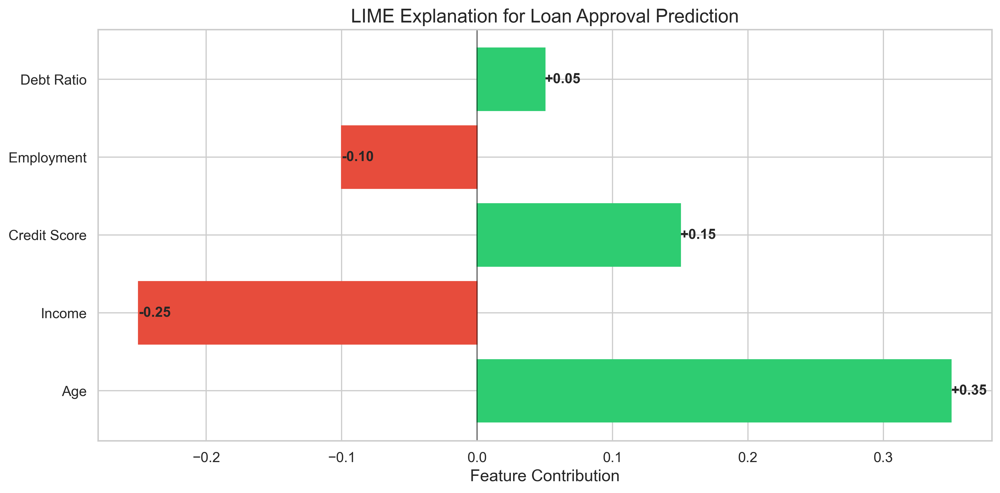

As machine learning models become increasingly complex, the need for interpretability grows proportionally[^1]. This post explores various techniques for making black-box models more transparent and interpretable.

The field of machine learning interpretability has seen significant growth in recent years, as shown in comprehensive works like @molnar2020interpretable, with researchers developing numerous methods to peek inside the "black box" of complex models.

## Feature Importance

Let's start with a fundamental concept in model interpretability: feature importance[^2]. Consider a simple random forest model:

```python
from sklearn.ensemble import RandomForestClassifier
from sklearn.datasets import make_classification

# Generate sample data
X, y = make_classification(n_samples=1000, n_features=20)

# Train model
rf = RandomForestClassifier()
rf.fit(X, y)
```

Feature importance can be visualized as follows:



## SHAP Values

SHAP (SHapley Additive exPlanations) values provide a more nuanced view of feature contributions, building on earlier work in interpretable ML @molnar2020interpretable. The mathematical foundation for SHAP values is given by:

$$
\phi_i(v) = \sum_{S \subseteq N \setminus \{i\}} \frac{|S|!(n-|S|-1)!}{n!}[v(S \cup \{i\}) - v(S)]
$$

Where:
- $\phi_i$ is the Shapley value for feature i
- $N$ is the set of all features
- $v$ is the characteristic function

## LIME Explanations

LIME (Local Interpretable Model-agnostic Explanations), introduced by @ribeiro2016lime, provides local explanations for individual predictions[^3]. The key insight behind LIME is that while a model might be globally complex, it can be approximated locally with a simpler model.



## Conclusion

Model interpretability is not just about understanding predictions—it's about building trust and ensuring accountability in AI systems. By combining various techniques like SHAP, LIME, and feature importance analysis, we can build a more complete picture of our models' decision-making processes.

The future of machine learning will likely see even more sophisticated interpretability techniques, as argued by @rudin2019stop, potentially leading to models that are inherently interpretable while maintaining high performance.

[^1]: Interpretability is particularly crucial in high-stakes domains like healthcare and finance, where understanding model decisions can have significant real-world impacts.
[^2]: Feature importance helps us understand which inputs contribute most to a model's decisions, providing a global view of model behavior.
[^3]: Local explanations are particularly valuable when we need to understand specific predictions, such as in medical diagnosis or credit approval systems.
