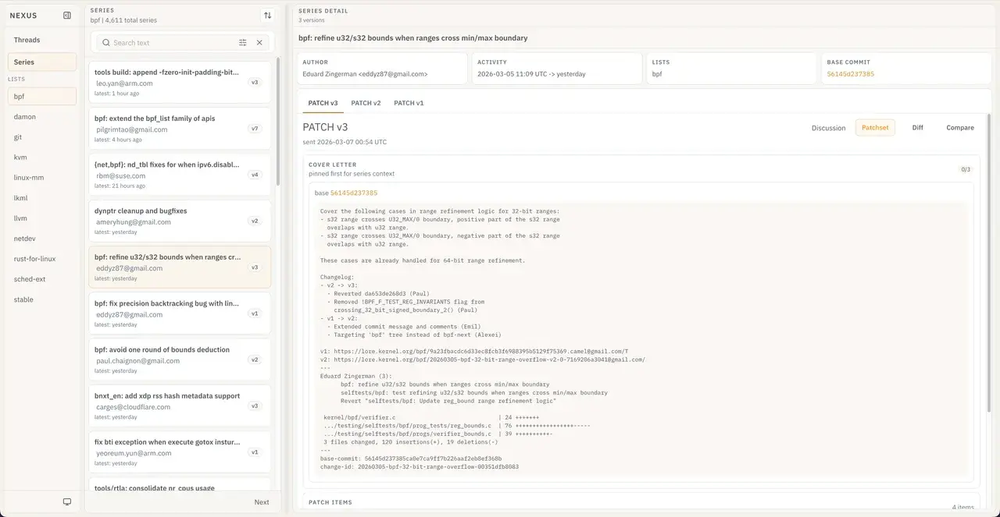
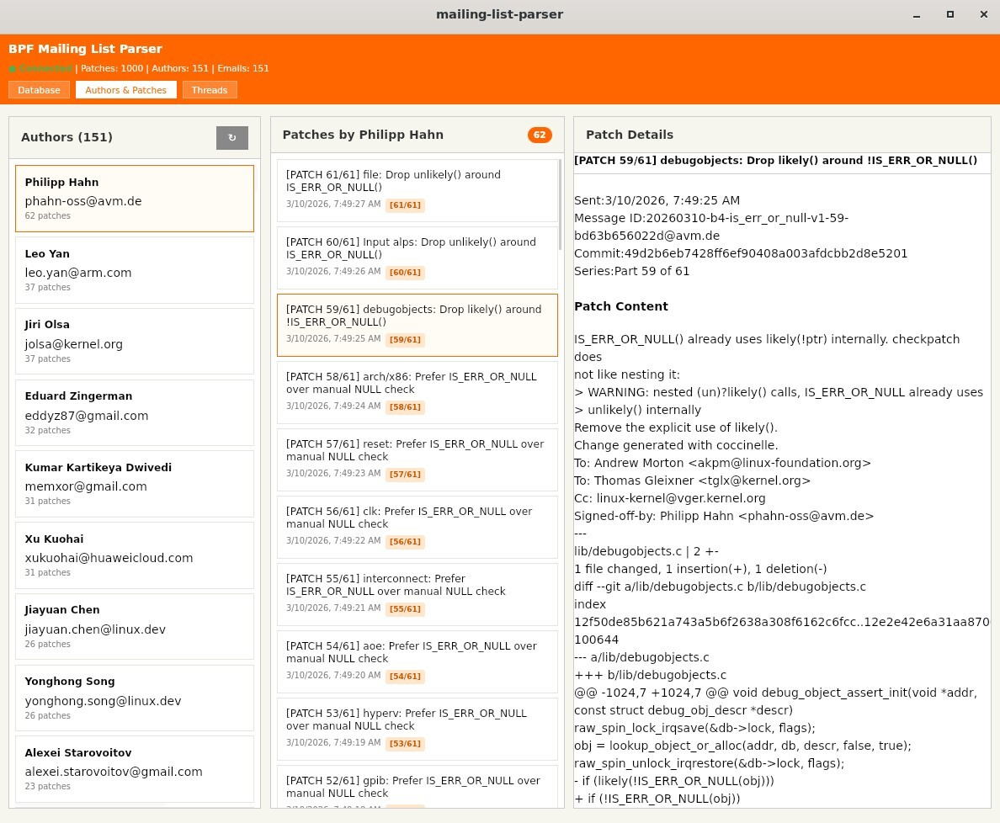
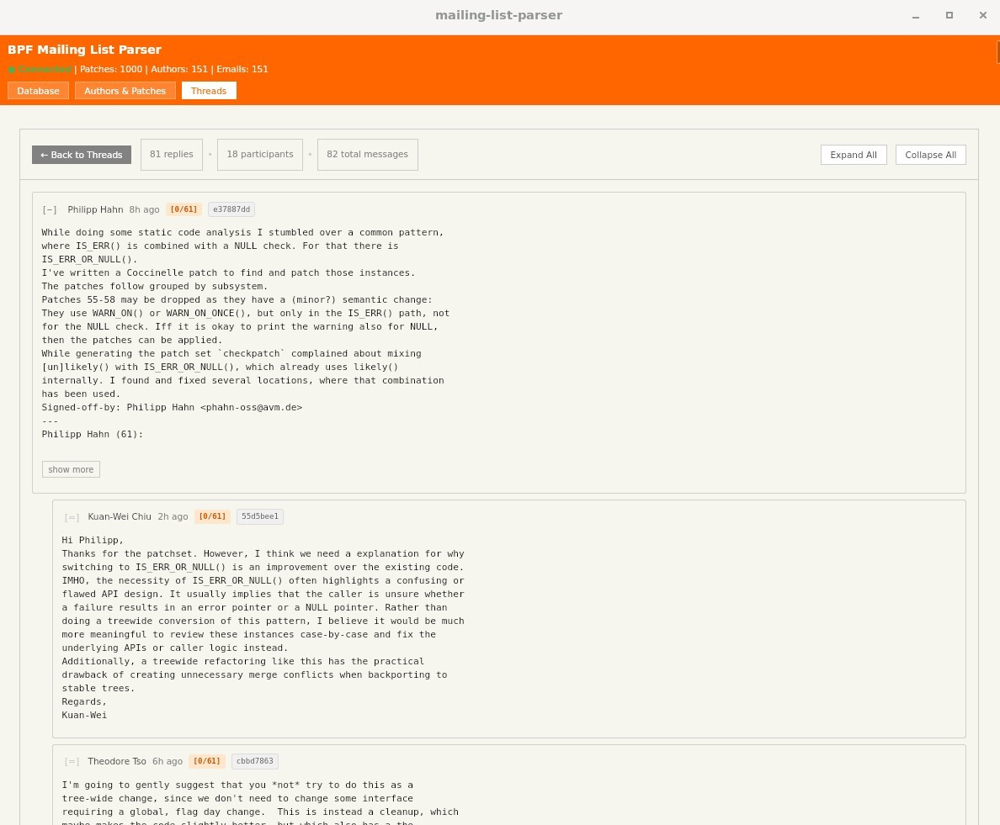
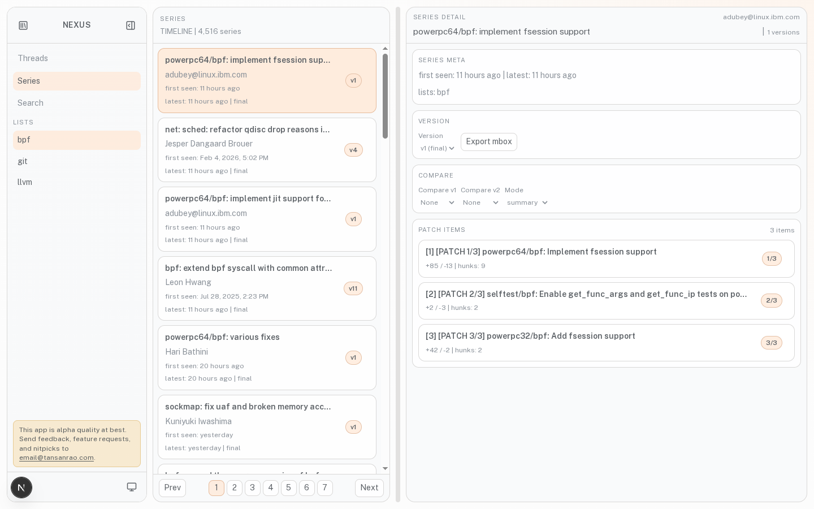

# Nexus KB Announcement

*Originally published on [Nexus KB](https://nexus-kb.com/blog/nexus-kb-announcement/).*

In September, due to the nature of our research, we spent our days looking through mountains of kernel mailing list entries. Day after day was spent digging through the eBPF mailing list and looking at the curious trajectory of certain primitives, such as loops and their spiral into a myriad of different functions and instructions (`time_may_goto` is weird). One of the most developed "frontends" to this archive was [lwn.net](https://lwn.net/). It was serviceable and presented a quite utilitarian view of the mailing list entries, even generously including links to other parts of the thread. However, clicking through various thread replies and needing to search for another patch in the series was quickly becoming tedious. It felt like everything needed an extra click due to the conventional website hyperlink layout. Within this, an idea emerged: why not make our own frontend for the Linux kernel mailing list with all the bells and whistles we could ever want? How hard could it possibly be?

Aside, ([lore.kernel](https://lore.kernel.org) also gets a shoutout, as it has a bit of git diff highlighting and even a nested thread view which displays everything in one glorious endless scroll. But it too suffers from issues a user can quickly identify.)

## Background

Some context on the Linux kernel mailing list is in order. It started with forum posts on USENET, with people coordinating about developing a little-known system known as Minix. Here, for example, is one of the [original messages](https://app.nexus-kb.com/threads/lkml/668329) Linus Torvalds sent in 1991 announcing his development, which is surprisingly available in the git archive thanks to this [effort](https://lwn.net/Articles/758034/). The call to action in this post would eventually form the first mailing list, `linux-activists`. This list would later evolve to feature a basic thread system and would transition into the official `linux-kernel` mailing list, with a number of sub-lists for each specific Linux subsystem. Parallel to this, many archiving efforts took place to keep a record of the messages sent. This culminated in the current [git archive](https://www.kernel.org/lore.html), which includes all of the known mailing list records (there is also this [good writeup](https://kernel.org/doc/ols/2008/ols2008v2-pages-7-18.pdf) on the fragmented nature of the mailing list and Linux documentation).

The mailing list serves two critical roles. The first is that it facilitates discussion on kernel features and bugs. The second is that it allows contributing to the kernel with what is known as a "patch." These patches, once reviewed by the community, go through a series of merges until they end up in an official kernel release.

## The Plan

Going into it, we had a small list of non-negotiables and then a much larger, endless list of nice-to-haves:

1. Search indexing: the sites above use [Xapian](https://xapian.org/), which is a very cool open-source search engine, but we can maybe do it better.
2. Better UI: this is a big one. Threads are naturally nested, so why not actually give them a proper nested display that you can collapse? Also, dark mode would be nice.
3. Proper patch series: all of the patches have a bunch of different versions, and the first of the series is the only one with an introduction. Currently, with the lists we have indexed, [this one](https://app.nexus-kb.com/series/lkml/100573) is \#1 with over 40 versions!

## Development

Development started off in a very 2025 manner: "the era of AI was nigh," said Egor's LinkedIn feed, and he decided that this was indeed the perfect opportunity to use this "revolutionary" bundle of matrices known as AI. After initiating a new GitHub repo and ordering it to use [Tauri](https://v2.tauri.app/), it was not long before it returned to him with its own custom mailing list parser and a UI that mostly worked after a lot more prodding. Even in this error-rich and barely functioning version, Egor had already found himself using it for browsing conversation threads on patches. After showing this demo to Tanuj, he was completely sold on the idea (being able to collapse a thread is quite the revelation).

Sometime around November, we had v2 of the prototype. This time, we used the same mail parser that existing frontends like LWN used ([b4](https://b4.docs.kernel.org/en/latest/) and [JWZ](https://www.jwz.org/doc/threading.html)). This gave us thread parsing and other basic features, such as proper FROM and TO header identification. Surprisingly, or unsurprisingly for those who know, mail parsing is quite the nightmare. All of the special formatting falls largely onto the user of the mailing list, and any mistakes need to be handled cleanly by the parser. In v2, this parsing, in spite of the help of b4, was largely a mess structurally, and it was importantly missing the ability to connect patch series, one of the aforementioned non-negotiables.

In addition, the majority of responses were not cacheable, meaning that our small locally hosted server would quickly become an expensive space heater under any significant server load (while nice for winter, the timing of this post in spring is a bit unfortunate). This naturally led to the third rewrite. Third time's the charm, right...?

By December, Nexus KB had settled into a very clear idea: it was not supposed to be a giant real-time processing system answering complex queries, but rather a knowledge base for exploring mailing-list threads and patch series that avoided putting expensive processing work on the request path.

The most important choice was the early decision to keep this system simple and inexpensive to operate. That constraint shaped almost every architectural decision. Instead of breaking each task into its own service and implementing complex queue infrastructure for "scale", we built the core of Nexus in Rust with a simple Postgres database. Why Rust? Because it's fast at our async tasks, and it's good enough for building simple APIs (async in Rust is quite the beast).

Our application is split into several components: we use Postgres as our DB, Meilisearch for search, an API server using Axum, and a worker written in Rust. That split is deliberate: Postgres owns truth, Meilisearch owns fast search, and the worker keeps request handlers read-focused. This way, our API can stay simple and predictable while ingestion, threading, lineage extraction, and search indexing happen in the background.

Nexus processes data on a per-list flow: `pipeline_ingest -> pipeline_threading -> pipeline_lineage -> pipeline_lexical`, with embeddings pushed to a lower priority. That sequencing represents our priority of fresh threads and series first; semantic enrichment catches up later. The system is optimized so users can see newly ingested material as soon as lexical search and browse data are ready, instead of waiting for the most expensive part of the search stack to finish.

We found some fun performance issues with our naive logic when the first ingest of the LKML mailing list took over 2 days to complete. We were parsing and writing emails into a Postgres table, and then repeatedly accessing full message bodies for threading, lineage, and search. This caused so much DB pressure that all operations started seeing second-long latencies. We then worked on identifying hotspots and adjusting processing orders and DB schemas to alleviate them. One major fix was to change the pipeline to parse and process everything that needs the full message body as part of the ingest phase so that we read a full email only once. Threading and lineage stages then fetch all the metadata needed once at the start of the job and work on them in memory.

Threading and lineage are where Nexus becomes specific to the Linux world. We use standard JWZ-style logic for rebuilding threads using a two-epoch sliding window on the public-inbox archive to bound memory use and B4-style logic for patch lineage detection. This way, Nexus tracks patch series as revisions and understands concepts like base commits and partial rerolls. This allows us to visualize the data closer to how kernel developers already think about patch history.

The series workspace is probably the clearest expression of what Nexus KB is trying to be. Instead of treating a patch series as a flat list of emails, it presents it as a lineage-first exploration surface: a fact row with author, list, and base commit data; a horizontal revision tab strip; a patchset view for reading the series as sent; a diff view for inspecting changes; and a compare view for understanding what changed between versions. The smaller UI choices support that framing. Cover letters stay visible, base commits link out when available, and the interface is dense by default to help users absorb a lot of technical information quickly.

## Conclusion

We hope that you give Nexus a shot for all of your Linux kernel mailing list searching needs! We even have a schedule set up to automatically have it index any new entries; it's roughly every 4 hours or so at the moment. We think that this version of Nexus KB is interesting not because it tries to do everything, but because we were able to narrow it down to what worked for us. It mirrors lore-style archives, models patch evolution in a way that matches real kernel workflows, and presents the result in a UI that is structured around threads and series rather than generic search pages. The result feels less like "a website over email" and more like a purpose-built system for understanding how technical discussion turns into code.
