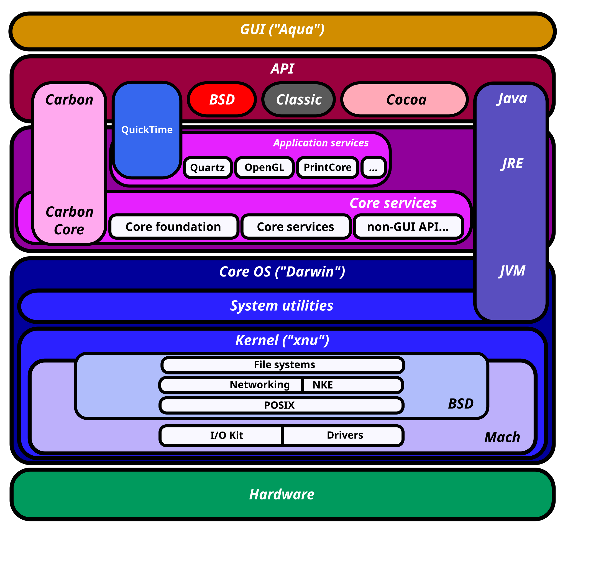

This post is the result of me going down a several week long XNU rabbit-hole
after reading [this post by Thomas Claburn on
Exclaves](https://www.theregister.com/2025/03/08/kernel_sanders_apple_rearranges_xnu/),
more on that later. I've tried my best to condense all the information into a
single blog post. I've also tried to keep sections self-contained so you can
skip around using the table of contents, this does come at the cost of
repeating myself in some places, so thanks in advance for your patience. While
I'm confident of my understanding on this topic, some errors are inevitable
when dealing with content this dense, if you spot any errors, assume them to be
mine and please reach out so I can correct it, also let me know your thoughts
by reaching out via email or mastodon. Thanks in advance and let's begin!

## Introduction
Apple’s Darwin operating system is the Unix-like core underpinning macOS, iOS,
and all of Apple’s modern OS platforms. At its heart lies the XNU kernel – an
acronym humorously standing for “X is Not Unix.” XNU is a unique **hybrid
kernel** that combines a Mach microkernel core with components of BSD Unix.
This design inherits the rich legacy of Mach (originating from 1980s
microkernel research) and the robust stability and POSIX compliance of BSD. The
result is a kernel architecture that balances modularity and performance by
blending microkernel message-passing techniques with a monolithic Unix kernel
structure. We'll go through a chronological exploration of Darwin and XNU’s
evolution – from Mach and BSD origins to the modern kernel features in macOS on
Apple Silicon and iOS on iPhones. We'll follow this with a deep dive into the
architectural milestones, analyze XNU’s internal design (Mach-BSD interaction,
IPC, scheduling, memory management, virtualization), and examine how the kernel
and key user-space components have adapted to new devices and requirements over
time.

## Darwin and XNU Development History
### Mach Microkernel Origins (1985–1996)
Darwin’s story begins with **Mach**, a project at Carnegie Mellon University
(1985) led by Richard Rashid and Avie Tevanian. Mach was envisioned as a
next-generation **microkernel** to address the growing complexity of UNIX
kernels. Instead of a single large kernel binary, Mach provided only
fundamental low-level functions – **memory management** (virtual memory,
address spaces), **CPU scheduling** (threads and tasks), and **inter-process
communication** (IPC via message passing). Higher-level services (file systems,
networking, device drivers, etc.) were intended to run as user-space _servers_
on top of Mach. This separation promised improved reliability (a crashed driver
wouldn’t crash the whole system) and flexibility (multiple OS personalities
could run concurrently). In fact, Mach’s design allowed running several
“personalities” – for example, UNIX and another OS – on one microkernel, a
concept analogous to modern virtualization.

By 1990, Mach had progressed to **Mach 2.5**, which was a microkernel but still
co-located some BSD kernel code in kernel space for performance. The true
microkernel version, **Mach 3.0**, arrived in 1991–1994. Mach’s **virtual
memory (VM) system** was influential beyond the project – it was adopted by
4.4BSD and later FreeBSD as their memory management subsystem. Importantly,
Mach introduced the concept of **tasks** (encapsulating an address space and
resources, roughly equivalent to a process) and **threads** (unit of CPU
execution) as first-class kernel objects. It also implemented an efficient VM
with copy-on-write and memory object abstractions, and a message-based IPC
mechanism using **Mach ports**.

Parallel to Mach’s development, **NeXT Computer** (founded by Steve Jobs in
1985) needed a modern OS for its workstations. NeXT adopted Mach early:
**NeXTSTEP**, released in 1989, was built on a Mach 2.5 kernel with a 4.3BSD
Unix subsystem layered on top. Crucially, NeXTSTEP’s kernel (later named
**XNU**) was not a pure microkernel system with user-space servers; instead, it
took Mach and **integrated the BSD code into the kernel address space** for
speed. In other words, NeXT used Mach’s abstractions (tasks, threads, IPC, VM)
and ran a BSD kernel _in kernel mode_ on top of Mach primitives. This hybrid
approach sacrificed some of Mach’s extreme modularity in favor of performance:
it avoided the heavy context-switching and messaging overhead that plagued
fully microkernel systems of the era. NeXTSTEP’s kernel also included an
object-oriented driver framework called **DriverKit** (written in Objective-C)
to develop device drivers as objects, reflecting NeXT’s preference for
higher-level languages.

By the mid-1990s, Apple’s original Mac OS (classic Mac OS) was aging and lacked
modern OS features like proper multitasking and memory protection. In 1996,
Apple sought an existing OS as its foundation for the future. The company
acquired NeXT in December 1996, choosing NeXTSTEP as the core of the new **Mac
OS X**. With this acquisition, NeXT’s Mach/BSD hybrid kernel came to Apple,
bringing along the engineering leadership of Avie Tevanian (Mach co-author) as
Apple’s VP of Software. Apple named the new OS project **Rhapsody**, which
would later become Mac OS X.

### Rhapsody to Mac OS X: Integrating Mach 3.0 and BSD (1997–2005)
After acquiring NeXT, Apple set out to merge the NeXTSTEP kernel with
additional features and hardware support needed for Macs. The kernel was
further updated with newer Mach and BSD technology. Notably, Apple incorporated
code from **OSFMK 7.3**, the Open Software Foundation’s Mach 3.0 kernel, into
XNU. This meant the Mach portion of XNU now drew from Mach 3.0’s true
microkernel lineage (including contributions from University of Utah’s Mach 4
research). On the BSD side, the NeXTSTEP kernel’s 4.3BSD subsystem was upgraded
with **4.4BSD and FreeBSD** code. This brought in a more modern BSD
implementation with features like improved networking and a robust filesystems
infrastructure. By combining Mach 3.0 and FreeBSD elements, Apple shaped XNU
into a powerful hybrid: Mach provided the low-level kernel architecture and
abstractions, while BSD provided the **Unix APIs and services** on top.

Apple also replaced NeXT’s old DriverKit with a new driver framework called
**I/O Kit**, written in a subset of C++. I/O Kit introduced a object-oriented
device driver model within the kernel, supporting features like dynamic device
matching and hot-plugging in a robust way. The choice of C++ (minus exceptions
and multiple inheritance, using Embedded C++ subset) for I/O Kit was likely to
improve performance and avoid the runtime overhead of Objective-C in the
kernel. By the late 1990s, XNU was thus composed of three core parts: the Mach
microkernel layer (now OSFMK 7.3 based), the BSD layer (largely
FreeBSD-derived), and the I/O Kit for drivers.

Apple delivered the first developer previews of Mac OS X in 1999, and in 2000
released the open source Darwin 1.0, which exposed the XNU kernel and basic
Unix userland to developers. The commercial debut, **Mac OS X 10.0 (Cheetah)**,
came in early 2001 (Darwin 1.3.1). While the initial releases were rough in
performance, they cemented the architectural paradigm. Key early milestones
included:
- **Mac OS X 10.1 (Puma, 2001)** – Improved performance in threading and added
  missing Unix features. Darwin 1.4.1 in 10.1 introduced faster thread
  management and real-time threads support.
- **Mac OS X 10.2 (Jaguar, 2002)** – Darwin 6.0 brought the synchronicity of
  the BSD layer with FreeBSD 4.4/5, plus large new features: IPv6 and IPSec
  networking, the new `mDNSResponder` service for discovery
  (Bonjour/Rendezvous), and journaling in HFS+ file system. It also upgraded
  the toolchain (GCC3) and added modern Unix utilities.
- **Mac OS X 10.3 (Panther, 2003)** – Darwin 7.0/7.1 integrated **FreeBSD 5**
  kernel improvements. This brought **fine-grained kernel locking** (moving
  away from the earlier giant-lock model) to better utilize multiprocessors.
  Panther’s kernel also introduced **integrated BFS** (basic firewall) and
  other performance tuning like improved VM and I/O.

Throughout these releases, XNU remained a 32-bit kernel (with limited 64-bit
user process support introduced in 10.4 for specific tasks). Apple maintained
support for PowerPC the Mac CPU architecture of choice in the early days while
also quietly keeping the Intel x86 compatibility (inherited from NeXTSTEP’s x86
support) in the source, preparing for future transitions.

A major architectural change arrived in **Mac OS X 10.4 (Tiger, 2005)**. This
was the first version where Apple declared OS X to be **UNIX 03 certified**,
meaning the system conformed to the Single UNIX Specification and could legally
use the UNIX name. Darwin 8 (Tiger’s core) achieved this UNIX certification by
virtue of the robust BSD layer integrated in XNU. Tiger also introduced new
kernel features like **kqueue/kevent** (from FreeBSD, for scalable event
handling), and laid groundwork for Intel Macs by keeping XNU cross-platform.
Apple then announced in 2005 the switch to Intel x86 processors for Macs. XNU’s
Mach foundations made such platform adaptability easier, as Mach abstracted
many low-level hardware details behind a portability layer. In early 2006,
Apple released **Mac OS X 10.4.4 for Intel**, demonstrating XNU running on
x86_32 with much of the code shared with the PowerPC build.

### Transition to 64-bit, Multi-Core and iPhone OS (2005–2010)
By the mid-2000s, computing had shifted to multi-core 64-bit architectures, and
Apple’s OS had to evolve accordingly. **Mac OS X 10.5 Leopard (2007)**, based
on Darwin 9, was a landmark release for XNU. It introduced extensive 64-bit
support: while earlier versions could run 64-bit user applications in limited
form, Leopard’s kernel itself could run in 64-bit mode on appropriate hardware
(x86-64) and support 64-bit drivers. Leopard also dropped official support for
older architectures like PowerPC G3 and brought in stronger security and
performance features: **address space layout randomization (ASLR)** to thwart
exploits, an advanced **sandbox** facility for restricting processes, and the
**DTrace** instrumentation framework from Solaris for low-level tracing.
Notably, Leopard was the last Mac OS X version to fully support PowerPC – Apple
was transitioning its entire lineup to Intel by this time.

In 2007, Apple also debuted the **iPhone** with “iPhone OS” (later named iOS),
which was built on Darwin as well. The first iPhone OS was based on Darwin 9
(same core as Leopard). This demonstrated the versatility of XNU: within the
same kernel version, Apple could target high-end PowerPC and x86 servers,
consumer Intel laptops, and resource-constrained ARM mobile devices. The kernel
gained support for the ARM architecture and tailor-made modifications for
mobile. For example, because early iPhones had very limited RAM and no swap,
the kernel’s memory management had to incorporate aggressive **memory-pressure
handling**. Apple introduced a **Jetsam** mechanism in iPhone OS, which
monitored low-memory conditions and killed background apps to free memory
(since traditional swapping to disk was not feasible on flash storage). iPhone
OS also ran all third-party apps in a _sandbox_ by design and required strict
code signing for binaries – security measures facilitated by XNU’s Mach and BSD
layers (Mach’s task port and codesign enforcement in the kernel, with help from
user-space daemons like `amfid` for signature validation).

**Mac OS X 10.6 Snow Leopard (2009)** marked the maturation of XNU on 64-bit
Intel. Snow Leopard (Darwin 10) discontinued support for PowerPC entirely,
making XNU a dual-architecture kernel (x86\_64 and i386 for Intel Macs). It
also was the first to ship with an _optional_ fully 64-bit kernel on capable
Macs (most defaulted to 32-bit kernel with 64-bit userland, except Xserve).
Snow Leopard brought major concurrency advances: the introduction of **Grand
Central Dispatch (libdispatch)** for user-space task parallelization and kernel
support for **dispatch queues**. While `libdispatch` is a user-space library,
it works closely with the kernel, which provides the underlying thread pools
and scheduling for dispatch queues. Another addition was **OpenCL** for GPU
computing, again requiring tight integration between user frameworks and kernel
drivers. Snow Leopard’s streamlined focus on Intel and multi-core optimizations
made XNU more efficient.

On the mobile side, **iPhone OS 3 (2009)** and **iOS 4 (2010)** (renamed “iOS”
in 2010) evolved alongside, adding support for the Apple A4/A5 ARM chips and
features like multitasking. XNU’s scheduler was adapted in iOS 4 to handle the
concept of background apps with different priority bands (foreground,
background, etc.), and to support **multi-core ARM SoCs** as they appeared
(e.g., the Apple A5 in 2011 was dual-core). iOS and macOS kernels remained
largely unified, with conditional code for platform differences. By **OS X 10.7
Lion (2011)**, XNU dropped support for 32-bit Intel kernels entirely – it
required a 64-bit CPU on Mac, reflecting the industry’s move beyond 32-bit.
Lion (Darwin 11) also improved sandboxing and added full support for new
features like **Automatic Reference Counting (ARC)** in Obj-C (with compiler
and runtime changes reflected in the system).

### Modern macOS and iOS Evolution (2011–2020)
From 2011 onward, Apple’s OS releases came in a yearly cadence, and Darwin
continued to get incremental but significant enhancements to support new
hardware and features:
- **OS X 10.8 Mountain Lion (2012)** and **10.9 Mavericks (2013)** (Darwin 12
  and 13) introduced power- and memory-optimizations in the kernel. Mavericks
  added **Compressed Memory**, a kernel feature where inactive pages are
  compressed in RAM to avoid swapping to disk. This was in line with iOS
  techniques to cope with low RAM, and it benefited Macs by improving
  responsiveness under memory pressure. Mavericks also implemented **Timer
  Coalescing**, where the kernel aligns wake-ups from idle to reduce CPU power
  usage. These changes show how the kernel adapted to energy-efficiency
  demands, influenced by mobile design philosophies. Additionally, around this
  time, Apple introduced **App Nap** and increased use of Quality-of-Service
  (QoS) classes for threads, which required kernel scheduling awareness to
  throttle or prioritize threads based on QoS hints (e.g., background vs
  user-initiated tasks). XNU’s scheduler evolved to support these multiple
  priority bands and energy-efficient scheduling.
- **OS X 10.10 Yosemite (2014)** and **10.11 El Capitan (2015)** (Darwin 14 and
  15) continued the trend. A major security addition in El Capitan was **System
  Integrity Protection (SIP)**. SIP (also called “rootless”) is enforced by the
  kernel’s security framework, preventing even root user processes from
  tampering with critical system files and processes. Implemented via the BSD
  layer’s Mandatory Access Control (MAC) framework, SIP hardened the OS by
  moving more trust into the kernel and away from user space. For iOS (iOS 9 in
  2015), similar “rootless” concepts were applied. Darwin 15 also saw Apple
  unifying the code base for OS X and iOS further, as they introduced
  **watchOS** and **tvOS** (both also Darwin-based) – XNU had to accommodate
  running on tiny Apple Watch hardware (S1 chip) up to powerful Mac Pros, with
  scalable scheduling, memory, and I/O capabilities. By now, XNU supported
  ARM64 (64-bit ARMv8, first used in iPhone 5s in 2013) and would go on to drop
  32-bit ARM support for iOS by **iOS 11 (2017)**.
- **macOS 10.12 Sierra (2016)**, **10.13 High Sierra (2017)**, **10.14 Mojave
  (2018)** (Darwin 16–18) brought filesystem evolution and further security.
  High Sierra introduced **APFS (Apple File System)** as the new default
  filesystem, replacing HFS+. APFS required kernel support for snapshots,
  cloning, and encryption at the container level. XNU’s VFS layer (in the BSD
  component) was extended to accommodate APFS’s advanced features and
  performance characteristics. During this era, kext (kernel extension)
  security was tightened – macOS High Sierra requires user approval for loading
  third-party kexts, and macOS Mojave introduced stricter code signing checks
  and hardened runtime for user-space processes that also influence how the
  kernel validates and allows certain operations. Another adaptation was
  graphics and external device support, High Sierra’s eGPU support via
  Thunderbolt required hot-plug handling improvements in I/O Kit and scheduling
  of external PCIe devices.
- **macOS 10.15 Catalina (2019)** (Darwin 19) was a significant modernization
  step for XNU. Catalina was the first to **deprecate most 32-bit code** (only
  64-bit apps, and the kernel had been 64-bit only for years already). More
  notably, Apple introduced a new approach for device drivers: **DriverKit**,
  reviving the name of NeXT’s old driver framework but with a new design.
  DriverKit in modern macOS allows many drivers to run in user space as
  **Driver Extensions (dexts)**, outside of the kernel. This is a shift towards
  microkernel philosophy for third-party code – by moving drivers (USB,
  network, etc.) to user-space processes, Apple improved system stability and
  security (a buggy driver can’t crash the kernel if it’s outside it). XNU was
  adapted to facilitate this: the kernel provides user-space drivers with
  controlled access to hardware (via IPC and shared memory) instead of loading
  their code as kexts. At the same time, Catalina split the OS filesystem into
  a read-only system volume, reinforcing the kernel’s SIP protections (the
  kernel now treats system files as immutable during runtime). These changes
  show how even decades after its birth, XNU’s architecture can pivot to
  incorporate more user-space responsibilities when beneficial, leveraging the
  Mach IPC mechanisms to do so safely.

### Apple Silicon Era (2020–Present)
In 2020, Apple undertook another monumental transition: moving the Mac lineup
from Intel CPUs to Apple’s custom **ARM64 SoCs** (the **Apple Silicon** chips,
starting with M1). Darwin had long supported ARM due to iOS, but running macOS
on ARM64 introduced new challenges and opportunities. **macOS 11 Big Sur
(2020)**, corresponding to Darwin 20, was the first release for Apple Silicon
Macs. XNU was already cross-platform, but it now had to support a heterogeneous
**big.LITTLE CPU architecture**: Apple Silicon chips combine high-performance
cores and energy-efficient cores. The scheduler was enhanced to be
**heterogeneity-aware**, ensuring high-priority and heavy threads run on
performance cores, while background and low-QoS threads can be scheduled on
efficiency cores to save power. Apple likely utilizes the thread **QoS
classes** (which had been introduced in earlier macOS/iOS) to map threads to
appropriate core types – this is an extension of Mach scheduling concepts to a
new domain of asymmetric multiprocessing.

Another aspect of Apple Silicon is the unified memory architecture (shared
memory between CPU/GPU). While largely abstracted by frameworks, the kernel’s
memory manager works with the GPU drivers (which are now Apple’s own,
integrated via I/O Kit) to manage buffer sharing without expensive copies. The
Mach VM abstraction fits well here – memory objects can be shared between
user-space and the GPU with VM remapping rather than duplication. Additionally,
Apple Silicon brought hardware features like **Pointer Authentication (PAC)**
and **Memory Tagging Extension (MTE)** for security. XNU’s ARM64 backend had to
support PAC (which it does by using PAC keys in exception frames and system
pointers to mitigate ROP[^1] attacks) and potentially MTE to detect memory
errors – these are deep architecture-specific enhancements in the kernel to
improve security on new hardware.

On the virtualization front, Apple Silicon prompted a reevaluation of
virtualization strategy. On Intel Macs, XNU has long supported virtualization
via the **Hypervisor framework** (introduced in macOS 10.10 Yosemite) which
allows user-space programs to run VMs using hardware VT-x support. With Apple
Silicon, macOS 11 introduced a new **Virtualization framework** built on top of
an in-kernel hypervisor for ARM64 (taking advantage of the ARM VMM features).
Notably, while the **open-source XNU** code does not include the Apple Silicon
hypervisor, the shipped kernel does initialize hypervisor support if running on
the appropriate Apple chip. This allows macOS on M1/M2 to run lightweight
virtual machines (for Linux, macOS guests, etc.) entirely from user-space
controllers, similar to Linux KVM. On iOS devices, Apple has kept the
hypervisor disabled or restricted (no public API), but the hardware capability
appeared with A14 chips. Enthusiasts quickly found that on jailbroken A14
devices, the hypervisor could be enabled to run Linux VMs[^2].

Beyond CPU and virtualization, Apple Silicon Macs run many of the same daemons
and services as iOS, indicating a convergence in system architecture. The XNU
kernel now powers everything from servers (macOS), personal computers, phones,
watches, TVs, and even the **bridgeOS** (a variant of Darwin running on the
Apple T2/M1 auxiliary processors for device management). Darwin’s **flexibility
and scalability** stem from the Mach foundation: it abstracts hardware
specifics in a platform layer, so adding a new CPU architecture (PowerPC → x86
→ ARM64) or scaling down to limited hardware largely requires implementing the
Mach low-level interfaces (like pmap for MMU, thread context switches, etc.)
and leaving higher-level kernel logic untouched. This design has paid dividends
in Apple’s transitions.

In summary, over two decades, XNU has undergone major transformations while
retaining its core identity. **Table 1** highlights a timeline of Darwin/XNU
milestones and architectural changes:

| **Year** | **Release (Darwin ver.)**        | **Key Kernel Developments**                                                                                                                                                                                                                                                                                                    |
| -------: | -------------------------------- | ------------------------------------------------------------------------------------------------------------------------------------------------------------------------------------------------------------------------------------------------------------------------------------------------------------------------------ |
| **1989** | NeXTSTEP 1.0 (Mach 2.5 + 4.3BSD) | NeXT’s XNU kernel hybrid introduced: Mach microkernel with BSD in kernel space for performance. Drivers via Obj-C DriverKit.                                                                                                                                                                                                   |
| **1996** | NeXT acquired by Apple           | Rhapsody OS development begins, based on OpenStep. Mach 2.5 + 4.3BSD XNU to be upgraded with Mach 3 and FreeBSD.                                                                                                                                                                                                               |
| **1999** | Mac OS X Server 1.0 (Darwin 0.x) | First Darwin releases (0.1–0.3) as Apple integrates OSFMK Mach 3.0 (OSF/1) and FreeBSD into XNU.                                                                                                                                                                                                                               |
| **2001** | Mac OS X 10.0 (Darwin 1.3)       | Darwin 1.x: Core OS X launched with hybrid kernel, BSD userland, Cocoa APIs. Early performance tuning of Mach/BSD integration.                                                                                                                                                                                                 |
| **2003** | Mac OS X 10.3 (Darwin 7)         | XNU sync with FreeBSD 5, bringing SMP scalability (fine-grained locking).                                                                                                                                                                                                                                                      |
| **2005** | Mac OS X 10.4 (Darwin 8)         | UNIX 03 certified kernel. Intel x86 support readied (Mach portability layer leveraged).                                                                                                                                                                                                                                        |
| **2006** | Mac OS X on Intel (Darwin 8.x)   | Apple transitions Macs to x86. XNU supports **Universal Binary** drivers and Rosetta translation (user-space emulation of PowerPC on x86).                                                                                                                                                                                     |
| **2007** | Mac OS X 10.5 (Darwin 9)         | 64-bit support in kernel (on x86\_64); last PowerPC support. Security: NX support, ASLR, code signing, sandbox introduced. **iPhone OS 1** (Darwin 9) released on ARM, with XNU scaled to mobile (no swap, sandbox always on).                                                                                                  |
| **2009** | Mac OS X 10.6 (Darwin 10)        | Intel-only (drops PowerPC). Fully 64-bit kernel on capable Macs; Grand Central Dispatch (kernel task queues); OpenCL support. iPhone OS -> **iOS 3** (Darwin 10) adds improved power management.                                                                                                                               |
| **2011** | Mac OS X 10.7 (Darwin 11)        | Drops 32-bit kernel support on Mac; Requires x86\_64. Expands sandboxing, FileVault 2 encryption (kernel crypto). **iOS 5** brings dual-core scheduling.                                                                                                                                                                        |
| **2013** | OS X 10.9 (Darwin 13)            | Power optimizations: compressed memory, timer coalescing in kernel. Improved multicore scheduling with QoS introduction.                                                                                                                                                                                                       |
| **2015** | OS X 10.11 (Darwin 15)           | **System Integrity Protection** (kernel-enforced security). Enhanced AMFI (Apple Mobile File Integrity) for code signing in kernel and user helper (amfid). iOS 9 / watchOS debut (Darwin 15) on new device categories, kernel runs on Apple Watch (ARM Cortex-A7).                                                            |
| **2017** | macOS 10.13 (Darwin 17)          | New APFS filesystem default on Mac (already in iOS 10). Kernel changes for cloning, snapshots. Kext loading requires user approval. iOS 11 drops 32-bit ARM, fully 64-bit kernel.                                                                                                                                              |
| **2019** | macOS 10.15 (Darwin 19)          | Legacy I/O Kit model shifts: **DriverKit** introduced for user-space drivers. System extensions modularize networking and endpoint security features out of kernel. macOS split system volume (read-only) to strengthen kernel’s protection of OS files.                                                                       |
| **2020** | **macOS 11.0 (Darwin 20)**       | **Apple Silicon support** – XNU on ARM64 Mac (M1). Kernel adapts to heterogeneous cores, unified memory. Rosetta 2 translation tier (user-space JIT, with kernel enforcing memory protections for translated code). **iOS 14** – exposes new virtualization features for developers (e.g., running lightweight VMs on iPadOS). |
| **2022** | macOS 13 (Darwin 22)             | Continued refinement for Apple Silicon (e.g., high-power mode on M1 Max, kernel scheduling tweaks). **iOS 16** – XNU adds support for virtualizing iOS/macOS guests (used in Xcode Simulator and Developer Mode features).                                                                                                     |
| **2024** | macOS 14 (Darwin 23)             | Ongoing improvements (Memory tagging support and fine-tuning for M2/M3 chips). Darwin remains the common core for **visionOS** (Apple Vision Pro AR headset) as well.                                                                                                                                                          |

**Table 1:** Timeline of Darwin/XNU evolution with selected kernel milestones and architectural changes.

This timeline shows how XNU’s Mach/BSD core proved to be a stable foundation
that Apple could incrementally enhance: adding 64-bit support, embracing
multicore, tightening security, and porting to new architectures, all while
retaining backward compatibility. Next, we delve into the internal architecture
of XNU – the hybrid kernel design that made all of this possible.

## XNU Kernel Architecture and Design

>File: Diagram of Mac OS X architecture.svg. (2024, December 29). _Wikimedia
>Commons_. Retrieved 22:59, April 3, 2025 from
>[https://commons.wikimedia.org](https://commons.wikimedia.org/w/index.php?title=File:Diagram_of_Mac_OS_X_architecture.svg&oldid=976998015).

### Hybrid Kernel Design: Mach + BSD Integration
XNU’s kernel design is often described as a **hybrid kernel**, because it
merges characteristics of microkernels (Mach) and monolithic kernels (BSD). In
a traditional microkernel, the kernel provides minimal services (IPC,
scheduling, VM) and everything else runs as user-space servers. In a monolithic
UNIX kernel, all OS services run in kernel mode as one large program. XNU
attempts to get “the best of both”: it uses Mach to modularize and abstract
low-level functions, but co-locates the critical BSD services in kernel space
for efficiency.

In XNU, the Mach component and the BSD component **run as a single kernel
entity** – they are linked into one binary and share the same address space.
There is no Mach vs BSD protection boundary; Mach functions and BSD functions
call each other via normal function calls within the kernel, not via IPC
messages. This co-location avoids the significant context-switch overhead that
a pure Mach system would incur (where a Unix system call would require
messaging a user-space BSD server). As a result, standard UNIX system calls
(file I/O, socket operations, etc.) in XNU perform comparably to other
monolithic Unix kernels, since the BSD code executes directly in kernel mode.
For instance, when a process calls `read()`, it traps into the kernel and the
BSD file system code is invoked directly; there’s no Mach message to a separate
process as would happen in a Mach 3.0 microkernel with an external BSD server.

**Mach’s Role:** Mach in XNU provides the core kernel **infrastructure and
abstractions**. Mach manages CPU _threads_ and task address spaces, implements
low-level scheduling, and handles virtual memory management (memory mapping,
paging). It also provides the fundamental **IPC mechanism** – Mach messages
sent over Mach _ports_ (communication endpoints). In XNU, every process (BSD
process) is backed by a Mach **task** and every thread by a Mach thread. The
Mach layer is responsible for creating and terminating tasks/threads, context
switching threads on the CPU, and implementing primitives like locks, timers,
and scheduling queues. It also implements the VM system: each task has a
virtual address map, memory regions are backed by Mach **memory objects**, and
Mach can perform copy-on-write copy optimizations and map propagation. Notably,
Mach supports **IPC-based memory sharing** – one task can send a memory object
(or a port right to it) to another, enabling efficient shared memory or
transfer of large buffers without copying.

**BSD’s Role:** The BSD component sits logically “on top” of Mach and provides
the traditional **OS personality** and services. This includes managing
**processes** (the BSD process table, PID allocation, user IDs, signals, etc.),
**POSIX threads** (which are mapped to Mach threads), and the entire set of
UNIX system calls (file systems, networking, IPC, device I/O, etc.). The BSD
kernel in XNU is derived primarily from FreeBSD (with substantial
OpenBSD/NetBSD influences and custom Apple modifications). It handles things
like:
- **VFS and File Systems:** XNU’s BSD layer implements a VFS (Virtual File
  System) and supports many file systems (HFS+, APFS, NFS, etc.). The file
  system code runs in the kernel and interacts with storage drivers via I/O
  Kit. Mach VM and BSD file systems meet when implementing memory-mapped files
  – Mach calls into BSD to fetch pages from files on disk (via the vnode
  pager).
- **Network Stack:** The entire TCP/IP stack (and other protocols like UDP,
  ICMP, as well as higher-level sockets API) is in the BSD kernel. This code
  came from BSD and is updated with modern standards. It interfaces with
  network drivers (in I/O Kit) for packet send/receive.
- **UNIX IPC:** Besides Mach IPC, XNU provides traditional Unix IPC (signals,
  pipes, SysV IPC, POSIX message queues, etc.) through the BSD layer. Signals,
  for example, are implemented by the BSD kernel, but interestingly signals are
  delivered using Mach exceptions under the hood – Mach exceptions are the
  low-level mechanism, and the BSD code translates them to Unix signals for
  processes as needed.
- **Security and Credentials:** The BSD layer manages user IDs, permissions,
  access control, and integrates several security frameworks. For instance,
  **KAuth** (Kernel Authorization) and the MAC Framework (Mandatory Access
  Control) operate in the BSD layer. Features like the Sandbox, SIP, code
  signing enforcement involve cooperation between BSD security modules and Mach
  task port restrictions. The sandbox (Seatbelt) in macOS/iOS uses the
  TrustedBSD MAC framework – when a system call is made, the MAC policy can vet
  it. This happens in the BSD layer, though the sandbox’s configuration is set
  from user space by launchd or other daemons.
- **POSIX APIs and Environment:** The BSD layer is what makes Darwin a UNIX. It
  provides `/dev` management (which often links to I/O Kit devices), system
  call table for standard C library calls, process forking (`fork()` is
  implemented partly by Mach (VM copy-on-write) and partly by BSD (duplicating
  file descriptors, etc.), and execve (loading binaries, setting up Mach task
  states and BSD process states).

In essence, one can think of Mach as the **core kernel supervisor** in XNU, and
BSD as a high-level kernel server that depends on Mach. The two are tightly
coupled – e.g., when a new BSD process is created via `fork()`, the kernel
internally calls Mach to create a new task and thread, then BSD code populates
the process structure and file descriptors. The BSD code calls Mach kernel
functions directly (not via message) using an internal API. Conversely, Mach
relies on some BSD services; for example, Mach has an abstraction called
“default pager” for managing swap. In XNU, the default pager is implemented
partly in user space (the `dynamic_pager` daemon) which uses Mach VM APIs to
create and manage swap files, but the BSD layer is involved in the actual file
I/O to the swap file. This shows a cooperative multi-tier design rather than
strictly separated layers.

**I/O Kit:** The third pillar of XNU is the **I/O Kit**, Apple’s
object-oriented driver framework. I/O Kit runs in kernel space (as part of the
XNU kernel), but it is written in a restricted form of C++ for type-safety and
code reuse. The I/O Kit defines a class hierarchy for devices (buses, storage,
network, display, etc.) and drivers subclass these to implement support for
specific hardware. Drivers in I/O Kit live as C++ objects within the kernel,
but they interact with user space through well-defined interfaces. For
instance, an I/O Kit driver can publish properties accessible via the I/O
Registry, and can provide **user client** interfaces that allow user-space
applications or daemons to call into the driver in a controlled way. I/O Kit
also supports limited **user-space drivers** historically (via user clients),
but in practice, until recent DriverKit, most drivers ran in kernel. The Mach
component provides threading and synchronization primitives used by I/O Kit
(like locks and workloops), while the BSD component interacts with I/O Kit for
networking and disk I/O (e.g., the BSD filesystem code calls an I/O Kit disk
driver to read a block). The decision to use C++ in kernel (contrary to the
“not written in C++” myth; the core kernel logic is C, but drivers are C++
classes) was made to improve extensibility. By eliminating multiple inheritance
and exceptions, Apple ensured the kernel would not suffer C++ runtime overhead.
Many drivers can be loaded and unloaded dynamically as **Kexts** (kernel
extensions), which are essentially loadable bundles of I/O Kit C++ classes or
additional BSD/Mach code. XNU’s modularity in this sense is reminiscent of
other OS kernels that allow loadable modules, but Mach’s abstractions also help
here (each kext is essentially a Mach-O image loaded into kernel memory and
linked).

**Mach IPC and Message Passing:** Even though XNU does not use Mach messages
for Unix _system calls_, Mach IPC is still heavily used throughout the system
for what we might call “RPC”-style interactions and for connecting
user-space services to kernel or to each other. Mach ports are the
foundation of various high-level features:
- Many kernel abstractions are represented as Mach ports to user space. For
  example, each task (process) has a Mach port (the task port) that represents
  its control handle. The kernel holds the rights, but certain privileged tasks
  (like `launchd` or debugging tools) can obtain send rights to manipulate
  other tasks (to start/stop them, inspect memory, etc.).
- Mach **notifications** are used for event delivery. The WindowServer
  (graphics system) receives user input events from the kernel via Mach
  messages. Likewise, higher-level APIs like Grand Central Dispatch under the
  hood use Mach ports to sleep threads waiting for events, leveraging Mach’s
  port-set and message mechanism. The `kqueue/kevent` mechanism in BSD is
  integrated: an event queue can wait on Mach port messages as well as file
  descriptors, unifying the event sources.
- **Inter-process Communication** for system services: Apple’s entire **XPC**
  framework (used by modern macOS/iOS for lightweight IPC between apps and
  services) is built on Mach messages. Each XPC connection is essentially a
  Mach port behind the scenes. The reason Mach IPC is chosen is its security
  model – Mach ports have an associated rights system and live in the kernel,
  so the kernel mediates who can send to whom. This allows checks like “is the
  sender task entitled to send this message?” which is used in services like
  the Keychain (securityd) to validate callers. Mach messages also support
  carrying out-of-line memory (shared memory regions) and port rights, which is
  extremely powerful for building higher-level RPC: you can send a file
  descriptor (which is a BSD concept) as a Mach port right in a message,
  enabling UNIX domain socket semantics via Mach. Under the hood, the file
  descriptor send uses a Mach port representing that file in the receiving
  task’s space.
- **Remote Procedure Calls:** Mach introduced MIG (Mach Interface Generator),
  which is used to define interfaces where one side is in kernel and the other
  in user. For example, the bootstrap server (launchd) and various system
  servers use MIG to auto-generate code for sending/receiving messages. The
  macOS `notify` system (for system-wide notifications) and many daemon APIs
  are implemented with MIG definitions.

Therefore, Mach IPC is a backbone for the macOS/iOS architecture beyond the
kernel boundary. It’s how user-space components talk to each other and to the
kernel in many cases. Even certain device drivers use Mach port notifications
(e.g., I/O Kit user clients might deliver an asynchronous event to a client via
a Mach message). The hybrid kernel thus uses Mach messaging where appropriate
(for asynchronous, out-of-band communication), and uses direct function calls
for in-kernel interactions. This hybrid approach retains Mach’s **modularity**
benefits – for instance, one can imagine refactoring a component to run in
user space with Mach messages without changing the other parts, since they
might already use a Mach port interface to talk to it. In fact, Apple did
exactly this with DriverKit: they moved certain drivers to user space and
replaced their in-kernel part with a Mach IPC conduit. The
performance-critical path (e.g., actual packet sending) might still be in
kernel, but higher-level policy or USB logic can be in a user process
communicating via Mach.

### Scheduler and Thread Management
XNU’s scheduling is rooted in Mach’s scheduler, which was originally a
priority-based round-robin scheduler with support for threads and processor
sets. Over time, Apple has modified the scheduler significantly to meet the
needs of desktop and mobile. The scheduler manages threads (Mach threads)
across CPU cores (XNU supports SMP and on Apple Silicon, asymmetric cores). Key
points of XNU scheduling:
- **Priority Levels:** Mach defines a range of thread priorities (0–127,
  historically) with certain bands reserved for real-time, kernel, and normal
  threads. Apple uses these priorities along with abstractions called
  **“sched_pri”** and **“base_pri”** for each thread. Time-sharing threads have
  priorities that can float based on usage (to implement favoring I/O-bound
  threads), whereas real-time threads have fixed priorities. The highest
  priorities are for critical kernel threads or timers.
- **Run Queues:** In classic Mach, each processor or processor-set had a run
  queue for threads. XNU has per-CPU run queues for efficiency. It also has
  mechanisms for **scheduler interrupts** to load-balance or preempt when
  necessary.
- **Extended Policies:** Apple added features like **container-level
  prioritization**. When iOS introduced App Sandbox with backgrounding, the
  scheduler got a concept of a “task role” or “priority group”. In Darwin 9
  (Leopard/iPhone OS), an “improved hierarchical process scheduling model” was
  noted, which suggests that threads were grouped by tasks or by “workload”,
  possibly to enforce limits on background tasks. This is likely the origin of
  **boosts and throttles** that iOS uses to ensure the foreground app gets more
  CPU than background apps.
- **Quality of Service (QoS):** In iOS 8 / OS X 10.10 and beyond, Apple
  introduced QoS classes (user-interactive, user-initiated, default, utility,
  background, etc.) for threads. The kernel scheduler integrates QoS by mapping
  them to priority bands and scheduling deadlines. Threads created by Grand
  Central Dispatch or NSThreads inherit a QoS that influences their scheduling
  priority and which core they run on. This was further refined on Apple
  Silicon where the scheduler might steer “background QoS” threads to
  efficiency cores. Internally, XNU’s `sched_prim.c` and `sched_perf.c` (for
  performance controller) handle these decisions. There is also an interface
  for the kernel to ask the power management firmware about energy vs
  performance (used in macOS’s power management QoS).
- **Realtime and Multimedia:** macOS supports realtime threads for audio or
  critical tasks. The scheduler has a realtime queue and will preempt other
  work to run RT threads to meet latency requirements. Also, since Mac OS X
  10.4, XNU has **scheduler deadlines** for real-time threads (used for audio
  playback, etc.), which is an EDF-like (Earliest deadline first) feature.
- **Idle and Power:** On mobile devices, the scheduler cooperates with the
  power management to aggressively idle cores. Mach scheduler invokes an idle
  thread when no work is available, and in iOS, if all cores are idle, the
  system can enter low-power states quickly. Timer coalescing (10.9 Mavericks)
  means the scheduler tries to batch wakeups – effectively, if several threads
  have timers expiring, it aligns them to let CPU sleep longer intervals.

Overall, XNU’s scheduler has evolved from Mach’s general-purpose design to one
aware of **multi-core** and **heterogeneous** cores, **energy vs performance**
trade-offs, and **workload groupings** (like apps vs system daemons vs kernel
threads). It still uses Mach’s thread data structures, but many scheduling
algorithms have been tuned by Apple (sometimes influenced by developments in
FreeBSD or other OSes).

### Memory Management and Virtual Memory
Memory management in XNU is primarily handled by Mach’s VM subsystem, which is
one of Mach’s strongest components. Key aspects:
- **Virtual Address Space:** Each Mach task has a virtual address space
  represented by a set of **VM maps** and **VM regions**. When a process (task)
  is created, it starts with a copy of the parent’s address space. Mach’s VM is
  inherently copy-on-write – `fork()` doesn’t duplicate all memory immediately;
  instead, both parent and child share pages marked copy-on-write until either
  writes, then a fault triggers an actual copy. This makes `fork()` efficient
  despite potentially large processes.
- **Memory Objects and Pagers:** Mach introduces the concept of _memory
  objects_ to represent a backing store for memory (like a file or the swap
  area) and _pagers_ which supply data to those memory objects on demand. In
  XNU, the **default pager** (for anonymous memory) is implemented by the
  `dynamic_pager` user-space daemon which manages swap files. That is, when the
  kernel decides to evict a page from RAM, Mach will send a message to the
  default pager indicating the page should be written to swap. The
  `dynamic_pager` then writes to the swap file (via normal file I/O). This is a
  classic microkernel design: the **pager runs in user space**, meaning the
  policy of how to manage swap space is not fixed in kernel. By adjusting or
  replacing dynamic\_pager, one could change swapping behavior (e.g., macOS’s
  dynamic\_pager can create multiple swap files on demand). File memory is
  managed by a different pager: the **vnode pager** inside the kernel (this one
  is not user-space, but part of XNU’s BSD layer) which interacts with file
  system code to read/write file data for memory mapped files. Having this
  modular pager design made features like **compressed memory** feasible to
  implement – in Mavericks, an in-kernel compression pager was added: when
  pressure is high, instead of immediately paging to disk, XNU can compress
  inactive pages and keep them in a reserved VM object (the “compressor pool”)
  in RAM. The VM considers that as a form of pseudo-swapping (faster than
  disk). Only if compression is insufficient does it resort to disk swap via
  dynamic\_pager.
- **Physical Memory Management:** XNU abstracts physical memory operations in a
  machine-dependent layer called **pmap** (physical map). The pmap manages page
  tables or equivalent structures on each architecture. When Mach allocates a
  new VM region, it uses pmap to map virtual pages to physical frames. On
  ARM64, pmap also integrates with security features (like marking pages with
  the appropriate permission keys for PAC, or handling aliasing issues with
  caches). The kernel uses a **zone allocator** for many kernel memory
  structures (zones are pools for objects of fixed size, like VM map entries,
  IPC port structures, etc.). There’s also a general-purpose **kernel malloc**
  (kmem) for variable sizes. Notably, the XNU kernel employs strategies to
  mitigate fragmentation and has guard pages for certain allocations to detect
  overruns (on debug kernels, typically).
- **Shared Memory and Map Inheritance:** Mach VM allows tasks to share regions
  – either explicitly via Mach IPC (sending a port for a memory object) or via
  inheritance (a child can inherit memory from parent on fork with
  copy-on-write or shared semantics). This is how the dynamic linker works in
  macOS: the shared cache of frameworks is mapped into every process at launch
  via a shared memory region provided by `dyld`. Mach makes this efficient by
  mapping the same physical pages into all tasks read-only.
- **Kernel Virtual Memory:** The kernel itself has a virtual address space.
  Mach manages kernel memory similarly to user memory, but there are
  differences: the kernel uses a single map for all of kernel space, and some
  regions are wired (non-pageable). XNU historically had a 32-bit kernel for
  which it used tricky schemes like a shared address space with user processes
  (in early OS X on 32-bit, kernel and user shared space to avoid costly
  segment switches, but on 64-bit this was not an issue). Modern XNU (64-bit)
  uses a separate address space for kernel, with portions (like the shared
  cache, comm page) mapped into user for communication.
- **Memory Protection:** Mach’s design enforces that one task cannot access
  another task’s memory unless explicitly allowed. This is basic memory
  protection via separate address spaces. The only controlled sharing is via
  Mach VM APIs or if the kernel (or a privileged daemon) maps memory into
  another task (used by things like the debugger or by the system frameworks to
  implement features like XPC shared memory). The kernel also zero-fills memory
  on allocation to avoid leakage between processes.
- **Evolution for Apple Silicon:** On Apple Silicon, with large physical memory
  and unified memory, XNU’s VM had to consider not having distinct GPU memory.
  Instead, I/O Kit drivers for GPU allocate from general memory with certain
  attributes (e.g., contiguous, protected). The pmap might have optimizations
  for the extremely large virtual address space (ARMv8.5 supports 52-bit VA).
  Also, memory tagging (MTE) if used would mean the kernel must manage tag
  bits in pointers and memory; Apple hasn’t announced using it, but the
  hardware is there on M2. If enabled, the kernel would tag allocations and
  check tags on load/store, catching use-after-free or overflow.

XNU’s VM is regarded as quite advanced due to its Mach heritage – it was built
for 64-bit from the start (Mach had 64-bit addressing on 32-bit hardware via
    abstractions), and it’s relatively decoupled from the rest of kernel logic,
    which is why Apple could plug in new features (compressor, different
    pagers) without massive overhaul.

### Virtualization Support
While Mach’s original vision could be seen as a form of virtualization
(multiple OS personalities on one kernel), modern hardware virtualization is a
different beast. XNU did not originally include a hypervisor in early releases,
but as virtualization became important, Apple added support. On **Intel Macs**,
XNU gained the ability to manage the hardware virtualization extensions (Intel
VT-x) around 2014. Apple provided a **Hypervisor.framework** API to developers
from OS X 10.10 onward, enabling user-space virtualization without third-party
kernel extensions. Under the hood, a kernel extension (or part of XNU) would
configure VMX operations, allowing a user-space process to act as a virtual
machine monitor. This was used by tools like **xhyve** (a port of FreeBSD’s
bhyve to macOS), and by virtualization apps when running without their own
drivers.

On **Apple Silicon (ARM64)**, the approach is similar conceptually: XNU on
these devices can act as a Type-2 hypervisor using ARM’s virtualization
extensions (EL2 on ARM). Apple introduced a more full-featured
**Virtualization.framework** in macOS 11, which builds on an in-kernel
hypervisor to let developers run Linux or even macOS VMs in user space. One
design decision on Apple Silicon was to not allow arbitrary third-party
hypervisors in kernel; instead, the hypervisor is part of XNU but only
accessible via Apple’s frameworks with proper entitlements (to maintain
security). 

From a kernel perspective, the XNU hypervisor functionality includes: managing
**guest physical memory**, handling **trap and emulate** for sensitive
instructions, and exposing virtual CPU interfaces to user space (for instance,
allowing a user program to set register state and run a vCPU until the next VM
exit). The Mach scheduling is leveraged to schedule vCPUs (which are just
threads from the host’s point of view). The memory subsystem is used to map
guest memory. On Apple Silicon, features like Stage 2 page tables for guests
are managed likely by an in-kernel hypervisor module.

Additionally, XNU supports containers and emulation in various ways (not full
virtualization but worth noting): the **XNU kernel supports multiple user-space
“personalities”** only in a limited sense now (for example, the Rosetta 2
x86\_64 code translator on ARM is not a separate OS but it does require the
kernel to manage alternate CPU context for x86 state). The kernel includes an
**x86 emulator** or at least support for handling x86 code segmentation, etc.,
when Rosetta translates x86 code to ARM64 – primarily done in user space by
Rosetta’s JIT, the kernel might assist e.g. with syscall translation or by
providing an x86\_64 syscall ABI on ARM.

The design choices around virtualization emphasize security and performance:
Apple’s approach is to keep the hypervisor simple and lean and to strongly
isolate guest OSes from the host (different Mach task, limited communication).
As of iOS 15, Apple even allows **virtualization on iOS** (to run Linux inside
an iPad app, for example, which some developers have demoed), indicating the
XNU hypervisor is capable on mobile as well, though subject to entitlement.

In summary, virtualization in XNU spans from the conceptual Mach
multi-personality support (not widely used in products outside early Classic
environment on OS X which ran Mac OS 9 in a para-virtualized setup), to robust
hardware-assisted virtualization on modern Macs. 

### Secure Computing
MacOS uses two complementary but distinct isolation mechanisms—**Secure
Enclaves** and the more recently introduced **exclaves**—to protect sensitive
operations and data.

The **Secure Enclave** is a dedicated, hardened subsystem integrated into
Apple’s SoCs (found in iPhones, iPads, Macs with T2 or Apple Silicon, etc.). It
runs its own microkernel‐based operating system (historically a variant of L4
called sepOS) and is used to manage and protect cryptographic keys, biometric
data, and other sensitive information. Its design isolates critical data even
if the main application processor or kernel is compromised. In short, it’s a
“trusted box” built into the hardware that handles security‑critical tasks
independently.

**Exclaves**, by contrast, are a newer security innovation (first appearing in
macOS 14.4 and iOS 17) that further subdivide the operating system’s
privileges. Instead of having all sensitive operations run in the same
privileged domain as the main XNU kernel, Apple is now isolating key resources
into separate, “externally located” domains. These resources—such as Apple ID
services for virtual machines, audio buffers, sensor data, and even components
that manage indicator lights—are pre‑configured at boot and are managed by
specialized kernel extensions (e.g., ExclaveKextClient.kext,
ExclaveSEPManagerProxy.kext, and ExclavesAudioKext.kext) along with private
frameworks.

In geographical terms, an enclave is a territory entirely enclosed within
another, which aptly describes the Secure Enclave’s containment within the SoC.
An exclave, on the other hand, is a fragment that is separated from the main
territory yet still associated with it—mirroring how these isolated resources
exist outside the main XNU kernel while remaining tightly integrated with the
overall system. This separation means that even if the main kernel is
compromised, the operations running in exclaves remain insulated, offering
additional defense in depth.

## Conclusion
Darwin and XNU offer a fascinating case study of an operating system that is
_neither fully microkernel nor monolithic_, but a judicious mix. Its evolution
illustrates trade-offs in OS design: performance vs. modularity, generality vs.
specialization. XNU’s Mach-based core, once considered a performance liability,
has proven to be a strength in adapting to new architectures and enabling
system-wide features (like seamless multi-OS integration on Apple Silicon, or
fine-grained sandboxing). Meanwhile, the BSD layer ensured that developers and
applications have a rich, POSIX-compliant environment, with all the expected
UNIX tools and APIs, greatly smoothing the adoption and software portability
for the platform.

In the modern era, as hardware trends move towards specialized processors and
increased parallelism, XNU continues to incorporate new techniques (e.g.,
dispatch queues, QoS scheduling, and direct support for machine learning
accelerators through drivers) while maintaining robustness. The Darwin OS,
through open source releases, also provides researchers a window into a
commercial-grade hybrid kernel (albeit not a very good window), inspiring
efforts in OS architecture that blend ideas from both camps of the classic
microkernel debate.

Apple’s Darwin has thus grown from a niche NeXTSTEP OS to the core of millions
of devices, all the while **tracing a line of continuity back to Mach and
BSD**. Each major transition – be it new CPU architectures (PowerPC→Intel→ARM),
new device categories, or new security paradigms – has been met by XNU with an
architectural answer: _extend_ (not rewrite) the kernel, _integrate_ components
tightly when needed, and _isolate_ through Mach IPC when possible. This
balanced evolution of Darwin’s kernel showcases a successful long-term OS
design, one that remains at the forefront of commercial operating systems while
rooted in decades of operating systems research.

**References:**
- Singh, Amit. _Mac OS X Internals: A Systems Approach_. Addison-Wesley, 2006
  (for historical and architectural insights).
- Apple Developer Documentation – Kernel Architecture Overview ([Kernel
  Architecture
  Overview](https://developer.apple.com/library/archive/documentation/Darwin/Conceptual/KernelProgramming/Architecture/Architecture.html)).
- Wikipedia: _XNU Kernel_ ([XNU -
  Wikipedia](https://en.wikipedia.org/wiki/XNU)), _Darwin OS_ release history
  ([Darwin (operating system) -
  Wikipedia](https://en.wikipedia.org/wiki/Darwin_(operating_system))).
- Chisnall, David. “What Is Mac OS X?” InformIT (2010) ([What Is Mac OS X? | A
  Mach-O System |
  InformIT](https://www.informit.com/articles/article.aspx?p=1552774)).
- 24C3: _Inside the Mac OS X Kernel_ (Ilja van Sprundel, 2007) ([Inside the Mac
  OS X
  Kernel](https://fahrplan.events.ccc.de/congress/2007/Fahrplan/attachments/986_inside_the_mac_osx_kernel.pdf)).
- Mazurek, Karol. "Snake&Apple X.NU" Medium (2024) ([Snake&Apple X.NU |
  Medium](https://karol-mazurek.medium.com/snake-apple-x-nu-0bc5c36170da)).
  (Security-focused kernel internals series).

[^1]: [Return-oriented
    programming](https://en.wikipedia.org/wiki/Return-oriented_programming) is
    a computer security exploit technique that allows an attacker to execute
    code in the presence of security defenses such as executable-space
    protection and code signing.

[^2]: [Hardware-accelerated virtual machines on jailbroken iPhone 12 / iOS 14.1
    | Worth Doing Badly](https://worthdoingbadly.com/hv/)

